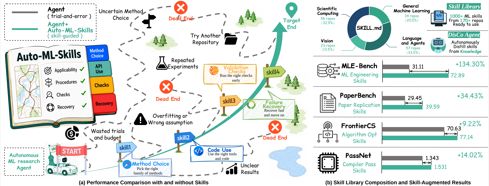
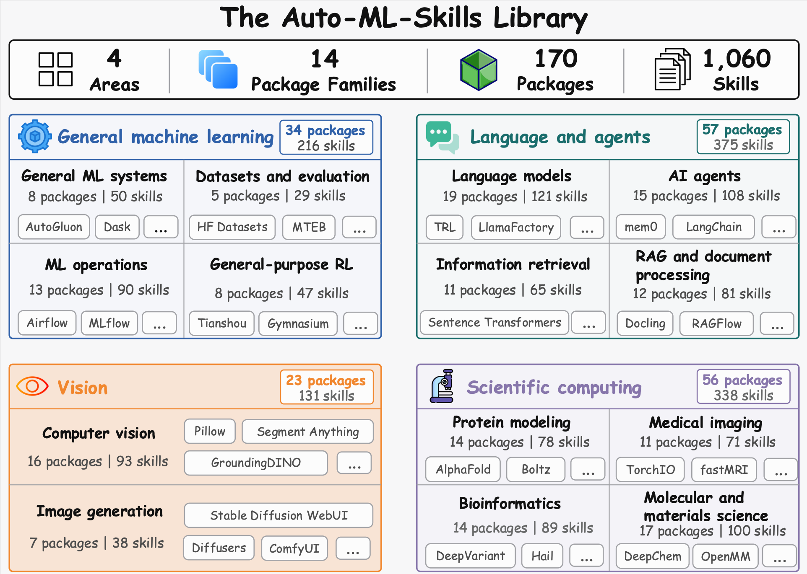

<h1 align="center">AREX-Skill</h1>

<p align="center">
  <strong>DisCo: A skill-powered research agent with task-related operating knowledge</strong>
</p>

<p align="center">
  <a href="research-skills-library/README.md"></a>
  <a href="https://www.npmjs.com/package/@auto-ml-skills/disco"></a>
  <a href="CONTRIBUTING.md"></a>
  <a href="LICENSE"></a>
</p>

<p align="center">
  <b>English</b> | <a href="README.zh-CN.md">简体中文</a>
</p>

<p align="center">
  
</p>

Auto-ML-Skills specializes what a research agent knows to consider without
prescribing how it must research. Relevant methods, procedures, checks, and
recovery actions are scattered across an LLM's parametric prior, repositories,
papers, benchmark resources, and other knowledge sources. DisCo reorganizes
source-grounded evidence into operating-knowledge skill graphs. In Creator
mode it constructs and verifies those graphs; in Researcher mode it loads the
task-relevant portion through progressive disclosure and uses code, tools, and
experiments to complete the research task.

The **Research Skills Library** is the growing collection of these reusable
skill graphs. It has two parts: task-agnostic skills distilled from widely
used ML repositories, and task-oriented skills constructed around specific
research tasks rather than general package usage.
This public checkout currently ships the task-agnostic repository collection:
**more than 1,000 operating skills organized into graphs for 170 widely used
ML and research repositories across 14 families and four broad areas**, plus a
library-level router. This repository collection is a first scale point for the
library, not its boundary.

> **Naming note:** Auto-ML-Skills is the repository name. DisCo is the
> user-facing CLI/runtime, and the Research Skills Library is the published
> reusable skill collection.

## 🧭 Table Of Contents <a id="table-of-contents"></a>

- [📣 News](#news)
- [💡 Why Auto-ML-Skills](#why-auto-ml-skills)
- [🧰 What Is Included](#what-is-included)
- [🗂️ Library Coverage](#library-coverage)
- [⚙️ Installation](#installation)
- [🚀 Quick Start](#quick-start)
- [🛠️ Creator Meta Skills](#creator-meta-skills)
- [🤝 Contributing](#contributing)
- [📚 Documentation](#documentation)
- [🙏 Acknowledgement](#acknowledgement)
- [📄 License](#license)
- [📝 Citation](#citation)

## 📣 News <a id="news"></a>

- **2026-08-03**: Auto-ML-Skills brings together DisCo's Creator and Researcher
  workflows and a Research Skills Library with 1,000+ operating skills for 170
  widely used repositories.

## 💡 Why Auto-ML-Skills <a id="why-auto-ml-skills"></a>

Research agents can propose methods, write code, run experiments, and iterate
on solutions. On a concrete ML research task, however, their success also
depends on whether they can identify and apply the right existing knowledge
within the same limited execution budget used to produce the final result.

- **Task-relevant knowledge is dispersed.** Applicable methods, tools,
  procedures, validation checks, and recovery actions may be split across the
  model's prior, source repositories, papers, task assets, and web resources.
- **Raw sources are not operating context.** An agent still needs to determine
  when a source applies, which evidence matters, how to execute it, what it
  should observe, and how to detect and recover from failure.
- **Reconstruction competes with research.** Re-reading and reconciling sources
  during every task consumes context, tool calls, compute, and experiment
  budget that could otherwise improve the research outcome.
- **Harnesses and skills specialize different things.** A harness governs how
  an agent plans, searches, critiques, and executes. Skills organize what the
  agent knows to consider, without forcing a fixed research trajectory.

We call this task-related body of methods, procedures, checks, and recovery
actions **operating knowledge**. DisCo turns source-oriented knowledge into an
operating-knowledge skill graph whose skills declare use conditions, execution
behavior, supporting evidence, validation steps, and failure handling. Creator
mode performs this ML knowledge distillation through evidence-backed
exploration, skill-graph generation, and verification with refinement.
Researcher mode then loads only the relevant graph fragment as its operating
context and applies it to the task.

## 🧰 What Is Included <a id="what-is-included"></a>

| Component | Purpose |
| --- | --- |
| [DisCo](src/) | The TypeScript research-agent CLI. Creator constructs and maintains skill graphs; Researcher uses operating skills with code, tools, and experiments. |
| [Research Skills Library](research-skills-library/) | The reusable operating-knowledge layer. This checkout publishes the task-agnostic repository collection: more than 1,000 skills organized into graphs for 170 widely used repositories, plus their sibling `repo-skills-router`. DisCo can also construct task-oriented skills around a specific research task's source constraints, evaluation protocol, and verification conditions. |
| [Examples](examples/) | Sanitized end-to-end sessions showing Creator building a FlagEmbedding skill graph and Researcher applying Gymnasium and Stable-Baselines3 skills to an auditable battery-dispatch experiment. |
| [Documentation](docs/) | Workflow, architecture, catalog, deployment, and portability guides. The 15 bundled Creator meta skills remain part of DisCo rather than a separate manual installation. |

Each session exposes a mode-specific skill inventory:

| Mode | Visible skills | Responsibility |
| --- | --- | --- |
| **Researcher** (default) | `operating` skills and user skills without `metadata.disco-role` | Use routed operating knowledge, code, tools, and experiments to complete an ML research task. |
| **Creator** | Skills explicitly marked `metadata.disco-role: meta` | Start with `distill-ml-knowledge`, choose `direct`, `reuse-existing` (one workflow or a bounded composition), or `design-reusable`, and send only a verified recurring construction gap to `design-meta-skill`. |

Use `--agent-mode creator|researcher` in non-interactive sessions, or
`/creator` and `/researcher` in the interactive UI. Switching opens a new
session with a clean context. See [DisCo Workflows](docs/disco-workflows.md) for
session/export behavior, detailed workflows, and deployment rules.

## 🗂️ Library Coverage <a id="library-coverage"></a>

The public repository collection spans 14 families and four broad areas. It is
built from a curated set of 170 widely used ML and research
repositories, producing 1,060 root and focused skills with broad coverage of
training, data, evaluation, agents, retrieval, vision, generation, ML
operations, and scientific computing.

DisCo's Creator CLI and bundled meta skills provide repeatable workflows for
creating, verifying, maintaining, and importing new skill graphs. A
library-level router and progressive disclosure let the task-agnostic
collection scale to more repositories, domains, software stacks, and languages
while loading only the repository skills relevant to the current task.

Beyond general package usage, DisCo can construct task-oriented skills for
specific research settings. In that path, the skill graph is organized around
the operating knowledge required by the task's source constraints, evaluation
protocol, and verification conditions rather than around one reusable package
workflow.



The [Imported Repo Skills Catalog](docs/imported-repo-skills.md) lists every
published graph with its upstream repository, update date, package version,
source commit, and intended workflow coverage.

## ⚙️ Installation <a id="installation"></a>

Using DisCo with the collection published in this repository requires both of
the following installation steps, in order:

1. Install the `disco` CLI.
2. Install the public repository-skill collection into DisCo's managed skill
   directory.

Installing portable Creator meta skills into another agent is optional. DisCo
already bundles them.

### Install DisCo

Install the DisCo CLI from npm:

```bash
npm install -g @auto-ml-skills/disco
disco
```

DisCo requires Node.js `>=22.19.0` and builds on
[Pi](https://github.com/earendil-works/pi)'s multi-provider model layer.
The npm package includes its own DisCo-modified coding-agent source and uses
pinned `@earendil-works/pi-agent-core`, `@earendil-works/pi-ai`, and
`@earendil-works/pi-tui` packages as dependencies. It does not depend on
`@earendil-works/pi-coding-agent`, discover `.pi` resources, or share a
globally installed Pi dependency tree.

Configure at least one provider in the startup flow with `/login`, or use
environment variables such as
`OPENAI_API_KEY`, `ANTHROPIC_API_KEY`, `GEMINI_API_KEY`, `OPENROUTER_API_KEY`,
or `MISTRAL_API_KEY`.

<details>
<summary>Build from source for local development</summary>

```bash
git clone https://github.com/VectorSpaceLab/Auto-ML-Skills.git
cd Auto-ML-Skills
# If model catalog fetching fails behind an HTTP(S) proxy, use: NODE_USE_ENV_PROXY=1 bash scripts/build-from-source-link.sh
bash scripts/build-from-source-link.sh
```

The script installs the standalone package dependencies from the checked-in
shrinkwrap, builds DisCo, and links the `disco` command globally for local use.

</details>

### Install The Published Repository Collection

Install the official collection and its router with DisCo:

```bash
disco repo-skills install
```

The command uses a shallow checkout of the official repository, installs only
the published runtime collection, and records its source commit. Git must be
available locally. Later, inspect or update the managed collection with:

```bash
disco repo-skills status
disco repo-skills update
```

`status` is local-only: it checks managed digests, router presence and current
skill coverage without contacting GitHub. Run `update` when you want to check
and apply the latest official commit.

Updates replace only official managed skill IDs. Repo skills created or
imported locally by Creator are preserved. If an official skill was modified
locally or collides with an unmanaged skill, the command stops; an explicit
`--force` update first keeps a recoverable backup.

DisCo registers the managed collection, but its repository roots and focused
sub-skills use `disable-model-invocation: true` and are omitted from the initial
model context. By default, `repo-skills-router` remains visible, routes to one
practical scenario, and then points DisCo to the selected skill under its
sibling `repo-skills/` collection. Automatic router selection can be disabled
and restored without uninstalling the collection:

```bash
disco repo-skills router disable
disco repo-skills router enable
```

When disabled, the router is omitted from automatic model selection but remains
registered for explicit `/skill:repo-skills-router` invocation. Start a new
Researcher session after an install, update, or router setting change.

<details>
<summary>Manual installation fallback</summary>

```bash
git clone https://github.com/VectorSpaceLab/Auto-ML-Skills.git
cd Auto-ML-Skills
mkdir -p ~/.disco/agent/skills
cp -R \
  research-skills-library/repo-skills \
  research-skills-library/repo-skills-router \
  ~/.disco/agent/skills/
```

Running `disco repo-skills install` later can adopt an unchanged manual copy and
preserve additional local skill IDs.

</details>

For router behavior, third-party skill packages, and deployment-scope details,
see [DisCo Workflows](docs/disco-workflows.md), the
[Research Skills Library guide](research-skills-library/README.md), and the
[DisCo CLI README](src/README.md).

### Portable Meta Skills For Another Agent (Optional)

DisCo already bundles its Creator workflows. To run them in another compatible
agent, follow [Meta Skills For Other Agents](docs/meta-skills-for-other-agents.md).

## 🚀 Quick Start <a id="quick-start"></a>

Researcher is the default. After completing both installation steps, ask for a
concrete research outcome; relevant repository skills are selected through the
router and opened progressively:

```bash
disco --agent-mode researcher -p "Benchmark vLLM and SGLang with the same model and workload on this machine. Tune each server under identical hardware and memory constraints, report the best verified throughput for each, and preserve the commands and measurements needed to reproduce the comparison."
```

Use Creator when the task needs a new or updated operating-skill graph. It
starts with `distill-ml-knowledge`, which normalizes the task and selects
`direct`, `reuse-existing`, or `design-reusable`. Direct distillation builds a
task-conditioned graph; `reuse-existing` invokes one adequate workflow or a
bounded composition; `design-reusable` hands an evidence-backed recurring
construction gap to `design-meta-skill`.

**Create skills for a specific repository.** The bundled repository workflow
already covers source inspection, environment preparation, skill generation,
verification, and import. `distill-ml-knowledge` therefore selects
`reuse-existing` with `reuse mode: single` and hands this request to
`create-repo-skill`:

```bash
git clone https://github.com/FlagOpen/FlagEmbedding.git
disco --agent-mode creator -p \
  "/skill:distill-ml-knowledge Create and verify a repository skill graph for the local FlagEmbedding checkout at ./FlagEmbedding. Use its documentation, examples, tests, and runtime APIs to cover embedding inference and evaluation. Prepare the CPU/GPU environments required by the confirmed scope, then ask before importing the verified graph."
```

**Create one task-related skill directly.** Use `direct` when an approved
knowledge-source directory can support the current task immediately and no new
reusable construction workflow is needed. This example distills guidance for
the classic Kaggle Home Credit Default Risk problem into one runtime
`SKILL.md`:

```bash
disco --agent-mode creator -p \
  "/skill:distill-ml-knowledge Use the direct path to create a task-related skill for Kaggle Home Credit Default Risk. The task description is at /path/to/home-credit-task/description.md, and the deep-research materials are in /path/to/home-credit-deep-research/. Output a single SKILL.md, verify it, and ask before importing it to .agents/skills/home-credit-default-risk/."
```

Creator validates and stages every output for approval. The repository graph
uses DisCo's managed repo collection, while the task-bound competition skill
defaults to the current project's `.agents/skills/`; each is imported only
after its own verification and approval, then used in a new Researcher session.
The full [DisCo Workflows guide](docs/disco-workflows.md) covers explicit skill
invocation, task-specific graphs, repository and paper construction,
verification, maintenance, export, deployment scopes, and mode-switch behavior.

## 🛠️ Creator Meta Skills <a id="creator-meta-skills"></a>

DisCo bundles 15 Creator-only meta skills for adequacy assessment, workflow
design, repository and paper distillation, verification, maintenance, and
cross-agent export. The canonical `distill-ml-knowledge` entry point owns task
normalization, adequacy/composition assessment, and path selection;
`design-meta-skill` only designs the reusable bundle after receiving a verified
`design-reusable` handoff. Each declares `metadata.disco-role: meta`;
Researcher does not see them. The [Bundled Skills Reference](src/packages/coding-agent/src/disco/skills/README.md)
is the source of truth for the full inventory and contracts. To run these
workflows outside DisCo, see
[Meta Skills For Other Agents](docs/meta-skills-for-other-agents.md).

## 🤝 Contributing <a id="contributing"></a>

We welcome contributions in three main areas:

1. **Contribute generated repo skills.** Add a publishable runtime skill under
   `research-skills-library/repo-skills/<skill-id>/`, include provenance and
   routing metadata, and update the sibling
   `research-skills-library/repo-skills-router/` so agents can discover it.
2. **Extend or refresh existing repo skills.** Improve stale, incomplete, or
   unclear skills with source-grounded changes. Update provenance or routing
   metadata when the upstream baseline or coverage changes.
3. **Improve the DisCo CLI source.** Changes to the TypeScript CLI under
   `src/` are welcome, including package/repo and paper-to-skill workflows.
   Run focused checks and document behavior changes. Repo-skill workflow
   changes should preserve the create/verify split, review/test artifact
   layout, import-readiness gates, and locked router-update transaction.
   Updates to the integrated Paper2Skills workflow should preserve its
   source-resolution, modularization, generated-skill validation, recovery,
   analysis, and final-report contracts.

For repo-skill PRs, list the model, provider, reasoning or thinking level,
source repository commit, and verification steps used to produce or revise the
skill. For DisCo CLI changes that touch paper-to-skill behavior, include the
paper source, run config, recovery mode, validation artifacts, and final report
path when applicable. See [CONTRIBUTING.md](CONTRIBUTING.md) for the full
checklist.

## 📚 Documentation <a id="documentation"></a>

| Page | Description |
| --- | --- |
| [DisCo Workflows](docs/disco-workflows.md) | Mode and session behavior, Researcher execution, Creator construction and maintenance, deployment scopes, and cross-agent export. |
| [Examples](examples/) | Sanitized Creator and Researcher session exports, including FlagEmbedding skill construction and Gymnasium/Stable-Baselines3 battery dispatch. |
| [Imported Repo Skills Catalog](docs/imported-repo-skills.md) | Public catalog of included runtime repo skills, organized by repository-skill family with upstream baselines. |
| [Research Skills Library](research-skills-library/README.md) | Broader library model, current repository-skill collection, canonical layout, and DisCo installation command. |
| [Architecture](docs/architecture.md) | Repository layers, mode boundaries, runtime routing, source layout, authoring pipelines, project/managed deployment scopes, and the managed repository library. |
| [Bundled Skills Reference](src/packages/coding-agent/src/disco/skills/README.md) | Role metadata, Creator meta-skill contracts, Researcher routing, and construction artifact layouts. |
| [Meta Skills For Other Agents](docs/meta-skills-for-other-agents.md) | Portable Creator-only workflow installation for Codex, Claude Code, and project-local agents. |
| [DisCo CLI README](src/README.md) | General task execution, runtime skill routing, package installation, and skill authoring workflows. |
| [Contributing](CONTRIBUTING.md) | Contribution rules for generated repo skills, router/catalog updates, workflow skills, documentation, and CLI source. |

## 🙏 Acknowledgement <a id="acknowledgement"></a>

DisCo's CLI and agent runtime are built on the foundation of
[earendil-works/pi](https://github.com/earendil-works/pi), an open-source AI
agent toolkit with a unified LLM API, agent loop, terminal UI, and coding-agent
CLI.

Auto-ML-Skills is also made possible by the GitHub open-source community. The
repo skills in this library exist because many researchers and engineers have
released high-quality ML, agent, data, bio/chem, vision, and infrastructure
projects for the community to build on.

## 📄 License <a id="license"></a>

The repository-level Auto-ML-Skills materials and the open-sourced runtime repo
skills under [`research-skills-library/`](research-skills-library/) are
released under the Apache License 2.0 unless a file states otherwise. The
standalone DisCo npm package under [`src/`](src/) is distributed under its own
[MIT License](src/LICENSE), with upstream attribution and third-party terms in
[`src/THIRD_PARTY_NOTICES.md`](src/THIRD_PARTY_NOTICES.md).

See [LICENSE](LICENSE) for the repository-level Apache-2.0 text.

## 📝 Citation <a id="citation"></a>

TBA
